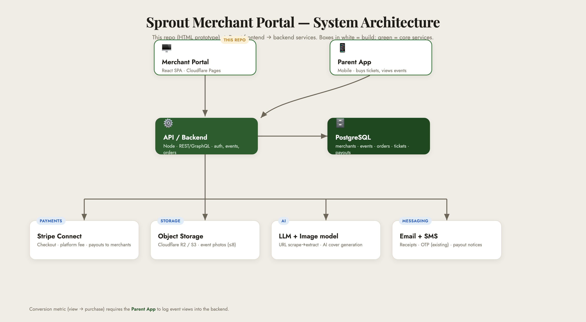

# Sprout — Merchant Portal · Engineering Handover

**Artifact:** `merchant-portal.html`
**Live prototype:** https://sprout-merchant.pages.dev
**Status:** Front-end design + interaction **prototype**. No backend, no real data, no logic.
**Goal of this doc:** everything needed to take this prototype to a production-ready, data-backed app.

---

## 1. What this file is (and isn't)

`merchant-portal.html` is a **single, self-contained HTML/CSS/vanilla-JS prototype**. It is the **source of truth for layout, copy, fields, flows, and states** — not shippable code.

**Per the team workflow:** this HTML → rebuilt in **React** → wired to the backend → deployed. Use it as the visual + UX spec; lift exact fields/copy/flows from it.

### ⚠️ Everything below is currently MOCKED — build for real:
| Area | Current (prototype) | Needs |
|---|---|---|
| Auth (login / signup) | just navigates, no check | real auth + OTP/email verify + sessions |
| All data (events, buyers, sales) | hardcoded in HTML/JS | DB + APIs |
| Image upload | visual tiles only | real file upload + storage |
| AI image generation | fake loading → gradient tiles | real image model + storage |
| Import-from-link (AI scrape) | fake checklist → pre-filled form | fetch + parse + LLM extraction |
| Door check-in | client-only toggle, resets on refresh | persisted state (ideally QR scan) |
| Payments / payouts | none | Stripe Connect (or equiv.) |
| Form validation / errors / empty states | none | full handling |

---

## 2. Recommended infrastructure



> Flexible — adapt to your team's stack. This fits the tools Sprout already uses (Cloudflare, React, existing SMS/OTP).

```
                          ┌─────────────────────────────┐
                          │   Sprout Parent App (mobile) │  ← buys tickets, views events
                          └──────────────┬──────────────┘
                                         │  REST / GraphQL
┌──────────────────────┐                ▼
│  Merchant Portal      │   HTTPS   ┌─────────────────────┐      ┌──────────────────┐
│  (React SPA)          │──────────▶│   API / Backend     │─────▶│   PostgreSQL     │
│  Cloudflare Pages     │           │   (Node/NestJS or   │      │   (primary DB)   │
└──────────────────────┘           │    your stack)      │      └──────────────────┘
                                    └───────┬─────────────┘
                 ┌──────────────────────────┼───────────────────────────┬──────────────┐
                 ▼                          ▼                           ▼              ▼
        ┌────────────────┐        ┌──────────────────┐       ┌──────────────┐  ┌──────────────┐
        │ Stripe Connect │        │ Object storage   │       │ AI services  │  │ Email + SMS  │
        │ (checkout,     │        │ (R2 / S3)        │       │ image-gen +  │  │ receipts,    │
        │  payouts, fees)│        │ event photos     │       │ URL scrape   │  │ OTP, payouts │
        └────────────────┘        └──────────────────┘       └──────────────┘  └──────────────┘
```

**Suggested stack**
- **Frontend:** React (Vite/Next), deploy on **Cloudflare Pages** (already in use)
- **Backend:** Node (NestJS/Express) or your preferred — REST or GraphQL
- **DB:** PostgreSQL (relational fits events/tickets/payouts cleanly)
- **Object storage:** Cloudflare **R2** or AWS **S3** (event images)
- **Payments:** **Stripe Connect** (Express accounts) — merchant onboarding, checkout, platform fee, automatic payouts
- **AI:** an LLM (e.g. Claude) for the URL-scrape extraction; an image model for cover generation
- **Email:** Resend / SendGrid / SES · **SMS/OTP:** reuse Sprout's existing provider
- **Auth:** JWT/session + the existing OTP flow
- **Hosting/infra:** Cloudflare (Pages + Workers/Tunnel) or your cloud of choice

---

## 3. Data model (core tables)

```
merchants
  id, email, password_hash, phone, phone_verified,
  business_name, business_type, website, bio,
  address_line1, address_line2, city, state, zip, country,
  stripe_account_id, created_at

bank_accounts            (or store via Stripe only — preferred)
  id, merchant_id, holder_name, routing, account_last4, bank_name, currency

events
  id, merchant_id, type ENUM('one_time','recurring','camp'),
  name, description, category, age_range, venue, status ENUM('draft','active','ended'),
  cover_image_id, created_at, source_url (nullable — for AI-imported)

event_images
  id, event_id, url, is_cover, sort_order

one_time_details        (1:1 with events where type=one_time)
  event_id, date, start_time, end_time, capacity, price, early_bird_price, early_bird_until

recurring_rules         (1:1)
  event_id, frequency ENUM('weekly','biweekly','monthly'), days[], repeat_until,
  start_time, end_time, capacity_per_session, price_per_session

sessions                (generated occurrences for recurring + camp weeks)
  id, event_id, name, date_start, date_end, capacity, price

camp_details            (1:1)
  event_id, daily_hours, early_bird_pct, early_bird_until,
  bundle_pct (3+ weeks), sibling_pct

age_groups              (camp)
  id, event_id, label, capacity_per_session

orders
  id, event_id, buyer_id, session_id (nullable),
  quantity, subtotal, fee, total, currency,
  status ENUM('pending','confirmed','refunded'),
  stripe_payment_intent, created_at

buyers
  id, name, email, phone   (parent/buyer; may link to a Sprout user)

tickets
  id, order_id, attendee_name, qr_code, checked_in_at (nullable)

payouts
  id, merchant_id, amount, status, scheduled_for, paid_at, stripe_transfer_id

event_views             (for the conversion metric — view → purchase)
  id, event_id, user_id, viewed_at
```

---

## 4. API endpoints (by feature)

**Auth & onboarding**
```
POST /auth/signup                 email + password
POST /auth/verify-otp             phone/email OTP
POST /auth/login
PATCH /merchants/me               business details + address (step 2)
PATCH /merchants/me/banking       → creates/links Stripe Connect account
```

**Events**
```
POST   /events                    create (one_time | recurring | camp)
GET    /events                    list (My Events) — status, sold, revenue
GET    /events/:id
PATCH  /events/:id                edit / publish / unpublish
POST   /events/:id/images         upload (multipart) → storage
POST   /events/import             { url } → AI scrape → returns draft event JSON
POST   /events/ai-cover           { prompt } → generates image → returns url
```

**Sales, buyers, check-in**
```
GET  /events/:id/buyers           per-event buyer list  ← (My Events → Buyers)
POST /tickets/:id/checkin         toggle door check-in (persist checked_in_at)
GET  /events/:id/buyers/export    CSV
POST /events/:id/message-buyers   broadcast message
GET  /analytics/summary           dashboard KPIs
GET  /analytics/events            top events incl. conversion (views→orders)
```

**Payments (Stripe)**
```
POST /checkout/:eventId           parent app → creates PaymentIntent
POST /webhooks/stripe             payment succeeded → create order/tickets, schedule payout
GET  /payouts                     history + pending
```

---

## 5. Feature build-notes (screen → backend)

- **Onboarding (4 steps):** Account → Details → Banking → Done. Banking step should **create a Stripe Connect (Express) account** and store `stripe_account_id` — don't store raw bank numbers yourself.
- **Create Event (3 types):** validate per type. Recurring → generate `sessions` from the rule. Camp → sessions (weeks) × age_groups, plus the 3 discount rules.
- **Import-from-link:** server fetches the URL, strips to text/metadata, sends to LLM with an extraction schema (name, date, times, venue, price, description, image), returns a **draft** the merchant reviews. Handle "field not found" gracefully (the prototype shows the amber "2 fields need your input" pattern). **Reliability is a priority for Tony** — log failures, allow manual fallback.
- **AI cover image:** prompt (auto-filled from title/description) → image model → store in `event_images`.
- **Image upload:** multipart → R2/S3, first image = cover, max 8.
- **Ticket Buyers:** **per-event** (accessed via My Events → Buyers, or the event picker). Show buyers, amount, status.
- **Door check-in:** `POST /tickets/:id/checkin` sets/clears `checked_in_at`; UI shows "N / total checked in". Production should ideally **scan the ticket QR** at the door, not just tap.
- **Conversion metric:** `views→orders`. Requires the **parent app to log `event_views`** — coordinate with the mobile team.
- **Payouts:** Stripe handles transfers; "arrives in 3 business days" reflects payout schedule.

---

## 6. Build sequence (suggested milestones)

1. **Auth + merchant profile** (signup, OTP, details, Stripe Connect onboarding)
2. **Event CRUD** (one-time first, then recurring, then camp) + image upload
3. **Checkout + webhooks** (parent app buys → order/tickets created) + payouts
4. **Buyers + check-in** + CSV/messaging
5. **Analytics** (KPIs, then conversion once view-tracking lands)
6. **AI: import-from-link**, then **AI cover generation**

---

## 7. Security & compliance
- **Never store raw card or bank numbers** — delegate to Stripe (PCI handled).
- Buyer PII (name/email/phone) → access-controlled, exportable per privacy policy.
- OTP **rate-limiting / lockout** (5–10 attempts → 24h lock) — flagged after the Ukraine OTP-abuse incident.
- Input validation + authz (a merchant can only see their own events/buyers).
- HTTPS everywhere; rotate API keys.

## 8. Config / env (indicative)
```
DATABASE_URL
STRIPE_SECRET_KEY  STRIPE_WEBHOOK_SECRET  STRIPE_CONNECT_CLIENT_ID
STORAGE_BUCKET  STORAGE_ACCESS_KEY  STORAGE_SECRET
LLM_API_KEY            (URL scrape + extraction)
IMAGE_GEN_API_KEY      (AI cover)
EMAIL_API_KEY  SMS_API_KEY
JWT_SECRET
```

---

_Prototype & spec by Ahmad Fauzan · Sprout. Questions on intended UX → reference the live prototype above._
