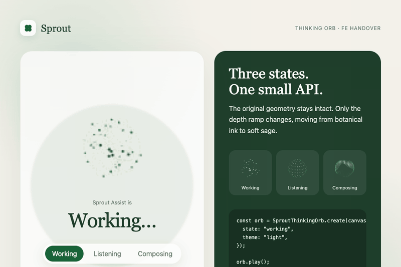

# Sprout Thinking Orb

Vanilla Canvas adapter for the three animated AI states used by Sprout Assist.
It ports the 64 px presets from [RareFormLabs/thinking-orbs](https://github.com/RareFormLabs/thinking-orbs) and maps their depth ramp to Sprout's official green palette.

**[Open the interactive preview](https://fauz2808.github.io/sprout-design-system-/)** · **[Read the implementation notes](ai-blob-handover/README.md)**

The handover is intentionally dependency-free. The implementation uses one JavaScript file, the browser Canvas API, and no framework runtime.

